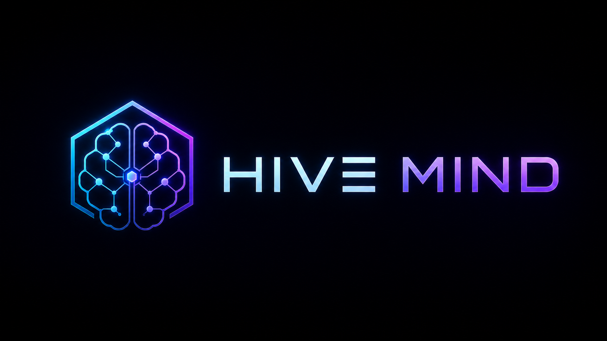
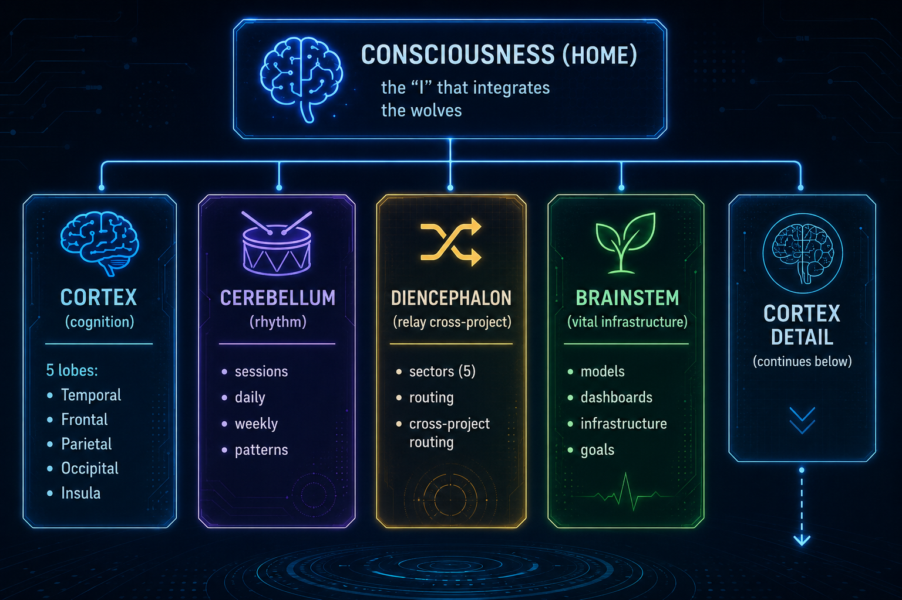
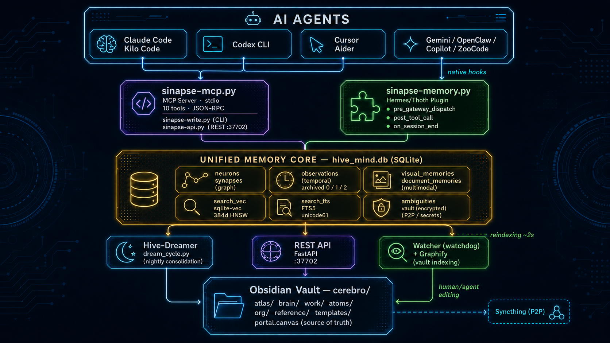
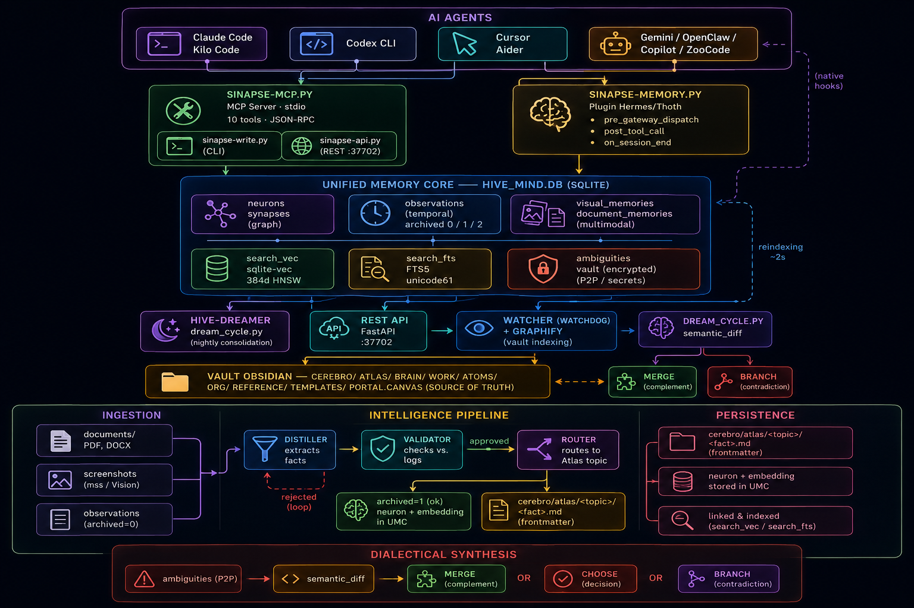
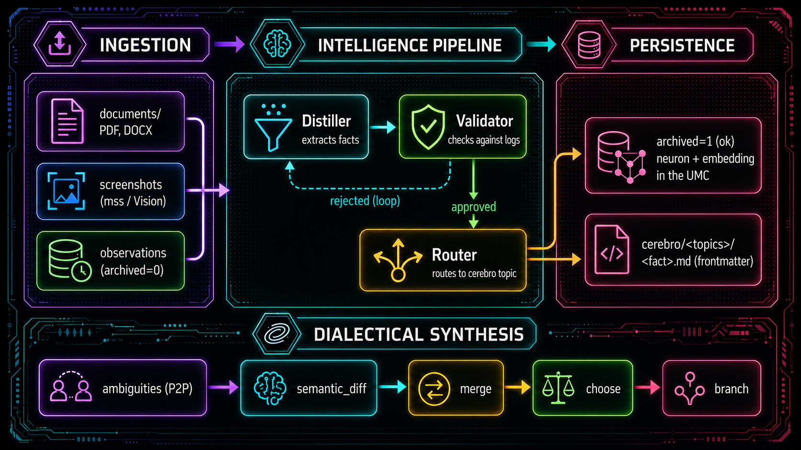
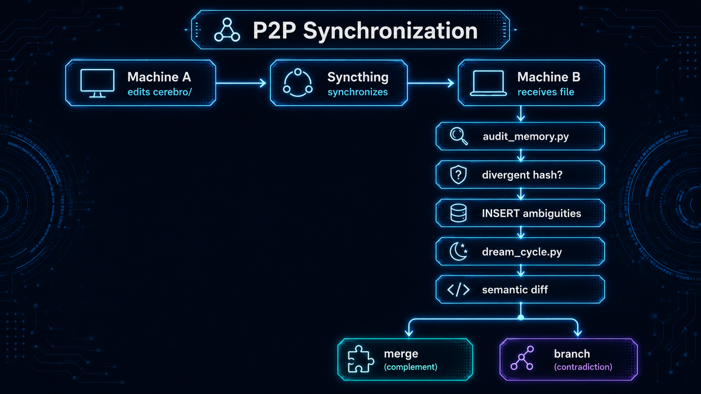

<div align="center">
  

  **Universal, persistent, local-first memory layer for swarms of AI agents.**

  [-blue)]()
  []()
  []()
  []()
</div>

---

**Hive-Mind** solves cross-session amnesia for AI agents. Everything agents **do** (logs), **see**
(screenshots), **read** (PDF/DOCX) and **decide** is consolidated into a single persistent brain —
the **Unified Memory Core (UMC)** — and materialized in natural language inside an Obsidian vault
(`cerebro/`), the single human- and agent-readable source of truth.

Multiple agents (Claude Code, Codex CLI, Cursor, Gemini CLI, Hermes, OpenClaw) share that brain via
MCP, native plugin, CLI or REST API — on one machine or across many, synced over P2P.

---

## ⚡ Quick Start — Configure With Your AI Agent

Copy a prompt below and paste it into your agent (Claude Code, Codex CLI, Gemini CLI, Cursor, ...).

### Initial Install Prompt

```
Clone and install Hive-Mind on this machine.

  git clone https://github.com/Mlaurindo30/Hive-Mind.git ~/Hive-Mind
  cd ~/Hive-Mind
  ./install.sh --profile=local-min --with-tests

Prerequisites: Linux with user systemd, Git, curl, uv, Node 18+, Bun and internet access.
The installer provisions Python 3.12 (managed by uv), .venv, Graphify, claude-mem,
NeuralMemory, RTK, services, indexes, MCP registrations and the local model stack.
The default profile pulls `snowflake-arctic-embed2:latest` for every embedding path,
`qwen2.5:3b`, `qwen2.5-coder:3b` and `minicpm-v4.6:latest` for local vision when
Ollama is new enough. On older Ollama daemons it falls back to `gemma3:4b`. The
heavy legacy `llava:7b` model is not part of the installer.

When it finishes, the installer asks whether to configure the LLM provider
(Gemini, OpenAI, Anthropic, Ollama, ...) via setup-brain.sh. Answer Y and follow
the menu to pick provider, model and API keys.

Headless / CI (no interactive terminal):
  HIVE_DREAMER_PROVIDER=google HIVE_DREAMER_MODEL=gemini-2.0-flash \
  GOOGLE_API_KEY=<your_key> ./install.sh --non-interactive

Full local validation profile:
  ./install.sh --profile=local-full --with-real-tests

After install, restart this agent. Only the orchestrator MCP `sinapse-memory` is
registered — it exposes Hive-Mind's 15 unified tools and federates global claude-mem
(~/.claude-mem), NeuralMemory, Graphify, Graphiti, UMC, sqlite-vec and filesystem under the hood.
```

### MCP Registration Prompt (project already installed)

```
Register Hive-Mind as an MCP server FOR YOURSELF — the agent reading this prompt.
Register only YOUR config, not anyone else's.

  cd ~/Hive-Mind
  ./scripts/setup/register-mcp.sh --only <your-agent>

Replace <your-agent> with your identity. Valid keys:
  claude codex gemini qwen kimi kiro kilo roo vscode cursor opencode openclaw

Examples: Claude Code → --only claude · Codex CLI → --only codex
          Gemini CLI → --only gemini · Cursor → --only cursor

It safely merges the project-managed `sinapse-memory` MCP into YOUR config, removes only
Hive-Mind's own legacy entries (claude-mem-local, neural-memory-local) and never touches
third-party servers. List keys: ./scripts/setup/register-mcp.sh --list
Check status without changes: ./scripts/setup/register-mcp.sh --only <your-agent> --check

After registering, restart yourself and confirm with: "use the sinapse_health tool"
```

> 📦 **Manual install, Windows (WSL2), prerequisites and the 12-step breakdown:** see
> [`docs/installation.md`](docs/installation.md).

---

## 🧠 What You Get

| | |
|---|---|
| 🧩 **Unified Memory Core** | One SQLite brain holding graph, logs, vectors, FTS, multimodal data and secrets — cross-dimension queries become plain SQL. |
| 🔌 **Agent-agnostic** | Any agent connects via MCP, native plugin, CLI or REST. No model is hardcoded. |
| 🌙 **Dream Cycle** | Offline consolidation turns raw observations into validated, human-readable knowledge. |
| 🔍 **Hybrid search** | Structural, temporal, vector, full-text, visual and documental memory in a single query. |
| 👁 **Multimodal** | Screenshots and PDFs/DOCX flow through the same pipeline as logs. |
| 🔄 **Local-first & P2P** | Works fully offline; optional multi-machine sync via UUID v4 + Syncthing. |
| 🔐 **Federated & private** | Ed25519-signed selective export with automatic PII redaction. |
| 📓 **Obsidian vault** | `cerebro/` is the readable single source of truth for humans and agents. |

---

## 🩻 Brain Anatomy

Hive-Mind is organized like a brain. The `cerebro/` vault mirrors the anatomy — **four sibling lobes
under Consciousness** (Cortex, Cerebellum, Diencephalon, Brainstem), with no hierarchy between them.

<div align="center">
  
  <br><sub><i>Consciousness integrates four sibling lobes — the Cortex expands into its five lobules (the "cortex detail" below)</i></sub>
</div>

The Cortex holds **five lobules of its own** — the *cortex detail* the diagram points to. Each lobe
maps to a function and a concrete place in the code/vault:

| Lobe | Function | Where it lives |
|------|----------|----------------|
| **Cortex · frontal** | Decision, planning, work | `core/`, `scripts/dream/dream_cycle.py`, `cortex/frontal/{decisoes,trabalho,brain,projetos,org}` |
| **Cortex · parietal** | Sensory — inbox, references | `scripts/capture/`, `cortex/parietal/{inbox,referencias}` |
| **Cortex · occipital** | Vision — captures + **graph** | `cerebro/cortex/occipital/grafo/graph.json` |
| **Cortex · temporal** | Long-term memory per project (primary axis) | `cortex/temporal/<project>/<topic>/neuronio-*.md` + UMC `hive_mind.db` |
| **Cortex · insula** | Health, self-awareness | `scripts/health/`, `cortex/insula/{saude,conflitos}` |
| **Cerebellum** | Rhythm — daily, weekly, sessions, patterns | `cerebelo/{sessoes,diario,semanal,padroes}/`, `cerebelo/padroes/Patterns.md` |
| **Diencephalon** | Cross-project relay | `diencefalo/setores/` (5 sectors) |
| **Brainstem** | Vital infrastructure | `tronco/{modelos,paineis,infra,meta}/` |

> The **Temporal lobule** is the primary axis — where per-project memory lives: one project-neuron per
> project with one fact-neuron per file (`neuronio-<hash>.md`), plus `_global/` (project-less prefs),
> `hipocampo/` (Dream Cycle consolidation) and `arquivo/` (cold memory > 90d).

External tools are **organs** of the brain, not parallel databases: Graphify (occipital), claude-mem
(temporal), NeuralMemory (association), filesystem scan (parietal). RTK lives in the Brainstem as a
cross-cutting execution layer. Full anatomy: [`docs/01-architecture.md` §2](docs/01-architecture.md).

---

## 🔌 Agent Integration

| Method | Agents | Mechanism |
|--------|--------|-----------|
| **Native plugin** | Hermes/Thoth | hooks `pre_gateway_dispatch`, `post_tool_call`, `on_session_end` |
| **MCP server** | Claude Code, Codex CLI, Cursor, Gemini CLI, Kilo Code, OpenClaw, Copilot, ZooCode, Aider | `scripts/services/sinapse-mcp.py` via stdio JSON-RPC |
| **Standalone CLI** | Any agent with a shell | `scripts/services/sinapse-write.py <subcommand>` |
| **REST API** | Remote agents / VPS | `scripts/services/sinapse-api.py`, Bearer auth, port 37702 |

### MCP Tools

| Tool | Purpose |
|------|---------|
| `sinapse_query` | RetrievalRouter query with audited path, citations and hybrid fallback |
| `sinapse_save_decision` | Save a decision to the vault (`cortex/frontal/trabalho/ativo/`) |
| `sinapse_save_learning` | Save a learning/insight to `cerebelo/padroes/Patterns.md` |
| `sinapse_health` | Health of the 7 read-backends, auxiliary components and K8 knowledge coverage |
| `sinapse_session_end` | End the session, update Current State |
| `sinapse_temporal_search` | claude-mem step 1: textual index with IDs |
| `sinapse_temporal_timeline` | claude-mem step 2: chronological window by ID/query |
| `sinapse_temporal_get_observations` | claude-mem step 3: full details by filtered IDs |
| `sinapse_temporal_save` | Save a raw temporal observation (server-beta or fallback) |
| `sinapse_zettelkasten_split` | Split monolithic notes into atomic notes |
| `sinapse_capture_screen` | Capture screen → visual memory |
| `sinapse_plan_goal` | Decompose a goal into steps and persist to UMC (HM-11) |
| `sinapse_temporal_graph_search` | Direct Graphiti/FalkorDB query (compatibility) |
| `sinapse_rag_query` | LightRAG multi-hop query |
| `search_memories` | HNSW/text search over consolidated neurons |

Project-managed MCP templates live in `config/mcp/`; generated per-agent runtime
configs are written by `scripts/setup/register-mcp.sh` into each agent's own config
location (for example Codex `~/.codex/mcp.json`, Cursor `.cursor/mcp.json`, Gemini
`~/.gemini/settings.json`).

---

## 🏗 How It Works

Agents read from and write to a single **Unified Memory Core** through MCP, native plugin, CLI or
REST. The diagram below shows how the agents, the UMC and the federated organs fit together.

<div align="center">
  
  <br><sub><i>End-to-end architecture: agents → MCP / CLI / REST → Unified Memory Core → federated organs</i></sub>
</div>

### 📈 Knowledge Architecture (K0-K10)

Hive-Mind is **born-large**: local-first by execution, built from day one for scale, pluggable
by contract. Every piece of knowledge moves through the same canonical pipeline:

```
Capture (hooks/MCP/CLI/browser/docs/code/screenshots)
  → Temporal Hippocampus (claude-mem: observations, discoveries, summaries)
  → Knowledge Intake (normalize, classify, dedupe)
  → Promotion Layer (raw → fact/decision/learning/preference/task)
  → Anatomical Memory (cerebro/ + UMC)
  → Index Layer (FTS, sqlite-vec/Milvus, Graphify, Graphiti, LightRAG)
  → Retrieval Router (intent-based routing with citations)
  → Answer + Citation → Feedback
```

<div align="center">
  
  <br><sub><i>Full K0-K10 pipeline: capture → temporal hippocampus → intake → promotion → anatomical memory → index → retrieval router → answer + citation → feedback</i></sub>
</div>

- **`VectorBackend`** (K2): one contract (`upsert/delete/query/hybrid_query/count/health`) over
  7 canonical collections (`memory_vectors`, `observation_vectors`, `document_vectors`,
  `code_vectors`, `visual_vectors`, `graph_vectors`, `summary_vectors`) — `sqlite-vec` locally,
  Milvus in production (`VECTOR_BACKEND=milvus`).
- **`DocumentPipeline`** (K6): ingests documents into parent + auditable chunks + citations.
  RAGFlow runs headless as an optional parsing adapter — never the source of truth.
- **`RetrievalRouter`** (K7, `core/retrieval/router.py`): routes by intent and always returns
  `retrieval_path`, `citations`, `confidence` and `missing_context`. LlamaIndex plugs in as an
  optional reranker adapter, never as the routing decision-maker.
- Neither Milvus, RAGFlow nor LlamaIndex ever replace the brain: the vault (`cerebro/`) and the
  UMC stay the source of truth (`docs/11` §16).

Full design: [`docs/11-knowledge-promotion-architecture.md`](docs/11-knowledge-promotion-architecture.md) ·
phase-by-phase backlog: [`docs/12-knowledge-implementation-plan.md`](docs/12-knowledge-implementation-plan.md).

### Memory dimensions

One store, queried across seven dimensions:

| Dimension | Question it answers | Implementation | Latency |
|-----------|---------------------|----------------|---------|
| **Structural** | What exists? How is it connected? | `neurons`/`synapses` in UMC | < 5 ms |
| **Temporal** | Who did what, and when? | `observations` via claude-mem | < 500 ms |
| **Vector** | What is semantically similar? | `VectorBackend`: `sqlite-vec` local or Milvus production (1024d, snowflake-arctic-embed2 via Ollama) | < 100 ms |
| **Textual** | Where does this term appear? | FTS5 `unicode61` with triggers | < 50 ms |
| **Visual** | What did the agent see? | `visual_memories` + LLM Vision | offline (Dreamer) |
| **Documental** | What did the agent read? | `document_memories` (PDF/DOCX) | offline (Dreamer) |
| **Execution** | How to optimize this shell command? | RTK (Rust), hooks/plugins per agent | < 2 s |

### 🌙 The Dream Cycle (Hive-Dreamer)

Offline consolidation: everything an agent experiences during the day (raw observations) is turned
into structured, validated, human-readable knowledge — facts, semantic links and an Atlas in the vault.

<div align="center">
  
  <br><sub><i>Raw observations → distillation → validation → consolidated facts written back to the vault</i></sub>
</div>

- **Provider-agnostic, per role:** each role (`dreamer`, `graphify`, `vision`, `synthesis`) picks
  provider+model via `HIVE_{ROLE}_PROVIDER/MODEL` in `.env`, inheriting from the Dreamer with opt-in
  fallback. Supports Google/Gemini, OpenAI, Anthropic, DeepSeek, OpenRouter, NVIDIA, HuggingFace,
  Qwen, LM Studio and Ollama.
- **Fail-safe:** a failing pipeline sends data to quarantine (`archived=2`), never discards it.
- **Multimodal:** screenshots and PDFs/DOCX enter the same pipeline as logs.

```bash
./scripts/setup/setup-brain.sh        # configure LLM per role (+ optional fallback)
python3 scripts/dream/dream_cycle.py  # trigger consolidation
```

Deep dives: [`docs/01-architecture.md`](docs/01-architecture.md) ·
[`docs/02-ai-models.md`](docs/02-ai-models.md).

---

## ⚙️ Configuration

```bash
cp .env.example .env
```

| Variable | Required? | Description |
|----------|-----------|-------------|
| `HIVE_DREAMER_PROVIDER` | For Dream Cycle | LLM provider (`deepseek`, `google`, `ollama`, ...) |
| `HIVE_DREAMER_MODEL` | For Dream Cycle | Model (`deepseek-chat`, `gemini-2.0-flash`, ...) |
| `HIVE_{GRAPHIFY,VISION,SYNTHESIS}_PROVIDER/MODEL` | No (inherit from Dreamer) | Per-role LLM |
| `HIVE_{ROLE}_FALLBACK_PROVIDER/MODEL` | No (opt-in) | Explicit fallback if the primary fails |
| `OLLAMA_EMBED_MODEL` | Local embeddings | Default `snowflake-arctic-embed2:latest` (1024d) |
| `HIVE_VISION_PROVIDER` / `HIVE_VISION_MODEL` | Vision | Default `ollama/minicpm-v4.6:latest` |
| `HIVE_VISION_FALLBACK_PROVIDER` / `HIVE_VISION_FALLBACK_MODEL` | Vision fallback | Default `ollama/gemma3:4b` |
| `HIVE_OCR_PROVIDER` / `HIVE_OCR_MODEL` | Optional OCR | `ollama/deepseek-ocr:latest`, opt-in for dedicated OCR |
| `VECTOR_BACKEND` | Vector store | `sqlite_vec` by default, `milvus` when enabled (K2 `VectorBackend` contract) |
| `RAGFLOW_BASE` | Optional document ingestion (K6) | `http://localhost:9380`, headless adapter — never the source of truth |
| `HIVE_MIND_API_KEY` | For REST API | Bearer token — API will not start without it (fail-closed) |
| `HIVE_MIND_API_HOST` | No (default `127.0.0.1`) | REST API bind host. Public binds make `/api/v1/workspaces` require Bearer auth. |
| `HIVE_MIND_API_PORT` | No (default 37702) | REST API port |
| `HIVE_MIND_CORS_ORIGINS` | No | Comma-separated CORS allowlist. Default `http://localhost:37700,http://localhost:8000`. |
| `HIVE_MIND_MASTER_KEY` | For secret vault | Field-level encryption key |
| `<PROVIDER>_API_KEY` | Per provider | `GEMINI_API_KEY`, `DEEPSEEK_API_KEY`, `NVIDIA_API_KEY`, ... |

> `.env` is gitignored and must never be committed. Use `./scripts/setup/setup-brain.sh` to manage
> credentials interactively.

**Common operations:**

```bash
./scripts/services/start-watcher.sh             # Real-time sync (Obsidian → SQLite)
python3 scripts/dream/dream_cycle.py            # Consolidation cycle
python3 scripts/health/audit_memory.py --fix    # Temporal neurons ↔ SQLite + search_vec audit
python3 scripts/health/validate_hive_mind.py    # System-wide validation
```

---

## ☁️ Cloud Memory API

FastAPI for remote UMC access (VPS), with mandatory Bearer auth, constant-time token comparison,
rate limiting and configurable CORS.

```bash
export HIVE_MIND_API_KEY="<token>"
python3 scripts/services/sinapse-api.py    # port 37702
```

| Endpoint | Method | Auth | Rate | Description |
|----------|--------|------|------|-------------|
| `/api/v1/health` | GET | No | 60/min | Health check |
| `/api/v1/workspaces` | GET | Conditional | 30/min | Workspace counts. Open on loopback; Bearer required on public bind. |
| `/api/v1/metrics` | GET | Bearer | 30/min | Operational metrics without memory contents |
| `/api/v1/knowledge/health` | GET | Bearer | 30/min | K8 coverage metrics, optional orphan-vector pruning |
| `/api/v1/observations` | POST | Bearer | 20/min | Register a remote observation |
| `/api/v1/query` | POST | Bearer | 30/min | Remote hybrid search through RetrievalRouter + Context Fusion |
| `/api/v1/semantic/related` | GET | Bearer | — | Semantic neighbors of a file |
| `/api/v1/neurons/export` | POST | Bearer | 10/min | Export neurons by visibility, with Ed25519 signature and PII redaction |
| `/api/v1/neurons/import` | POST | Bearer | 10/min | Import signed neurons from a trusted peer |
| `/api/v1/sync/export` | GET | Bearer | 30/min | Export CRDT changes for P2P pull |
| `/api/v1/sync/import` | POST | Bearer | 30/min | Import CRDT changes for P2P push |
| `/api/v1/vault/{secret_id}` | GET | Bearer | 10/min | Retrieve an encrypted secret |

---

## 🔄 P2P Sync

<div align="center">
  
</div>

- UUID v4 on every PK — no cross-machine collisions
- SHA-256 content hash in `neurons.hash` — deterministic detection
- `audit_memory.py --fix` — reconciles temporal neurons ↔ SQLite, validates `search_vec`, and keeps generated MOCs out of the neuron index
- Dialectic Synthesis in the Dream Cycle resolves conflicts via LLM

Full setup: [`docs/07-p2p-sync-setup.md`](docs/07-p2p-sync-setup.md).

---

## ✅ Tests

```bash
./tests/run_all.sh    # Smoke → Unit → Integration → E2E
```

| Suite | Scope | Real LLM? |
|-------|-------|-----------|
| Smoke | Binaries and system health | No |
| Unit | Backends (mocks), helpers, Dream Cycle queue, audit regressions | **No** |
| Integration | Read/write flows, MCP, API, hybrid search | Real backends |
| E2E | Full session, degradation, concurrency, recovery | Real backends |
| Synthesis (`test_synthesis.py`) | `run_synthesis_cycle()` end to end | **Yes** |

The repository currently contains hundreds of test functions across smoke, unit,
integration, E2E and real knowledge suites. Unit tests do not call an LLM; real
model/runtime validation lives in integration/E2E suites and `tests/run_real_knowledge.sh`.

---

## 🔒 Security

- **Fail-closed:** the API refuses to start without `HIVE_MIND_API_KEY`; constant-time token comparison.
- **Encrypted vault:** detected secrets are field-level encrypted (Fernet, `vault` table).
- **Zero secrets in code:** every credential lives in `.env` (gitignored).
- **Rate limiting** on all sensitive endpoints.
- Personal memory databases and venvs protected in `.gitignore`.

---

## 🛠 Troubleshooting

| Problem | Fix |
|---------|-----|
| Dream Cycle won't run | `./scripts/setup/setup-brain.sh` → check provider/model/balance |
| Watcher not syncing | `./scripts/services/start-watcher.sh`; inspect `watcher.log` |
| API won't start | Set `HIVE_MIND_API_KEY` in the environment |
| MCP won't connect | Check the agent config and the path to `scripts/services/sinapse-mcp.py` |
| Observations vanished from queue | `SELECT * FROM observations WHERE archived=2` (quarantine) |
| Vault ↔ SQLite diverged | `python3 scripts/health/audit_memory.py --fix` |
| claude-mem worker stopped | `systemctl --user restart sinapse-claude-mem.service` |
| Stale graph | `./scripts/graph/build-graph.sh` |
| General recovery | `./scripts/utils/recover.sh` |

---

## 📚 Documentation

| Document | Contents |
|----------|----------|
| [`docs/installation.md`](docs/installation.md) | Install reference (prerequisites, WSL2, 12 steps, components) |
| [`docs/01-architecture.md`](docs/01-architecture.md) | Canonical architecture reference + brain anatomy + ADRs |
| [`docs/02-ai-models.md`](docs/02-ai-models.md) | LLMs, embeddings, providers, fallback |
| [`docs/03-data-pipeline.md`](docs/03-data-pipeline.md) | Full data pipeline |
| [`docs/04-infrastructure.md`](docs/04-infrastructure.md) | Infrastructure, ports, services, security |
| [`docs/05-blueprints.md`](docs/05-blueprints.md) | ASCII diagrams of every flow |
| [`docs/07-p2p-sync-setup.md`](docs/07-p2p-sync-setup.md) | P2P synchronization setup |
| [`docs/11-knowledge-promotion-architecture.md`](docs/11-knowledge-promotion-architecture.md) | Knowledge promotion architecture |
| [`docs/12-knowledge-implementation-plan.md`](docs/12-knowledge-implementation-plan.md) | K0-K10 implementation plan |
| [`docs/reports/k9-real-suite-report.md`](docs/reports/k9-real-suite-report.md) | Latest real-suite evidence report |
| [`AGENTS.md`](AGENTS.md) | Guide for AI agents |

---

## License

Apache 2.0
