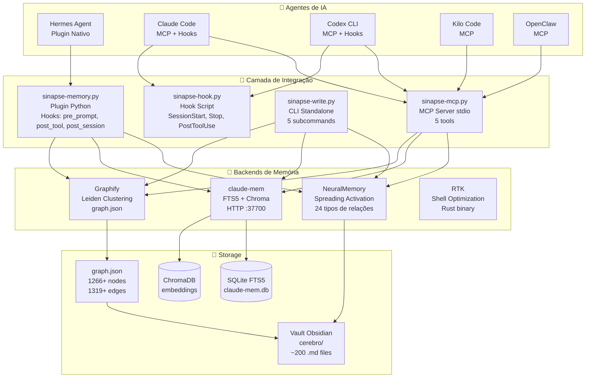
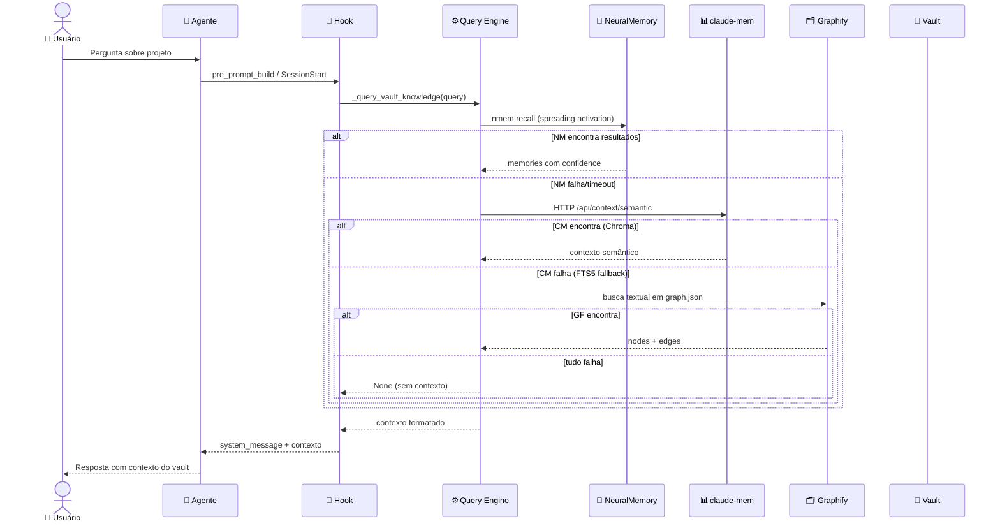
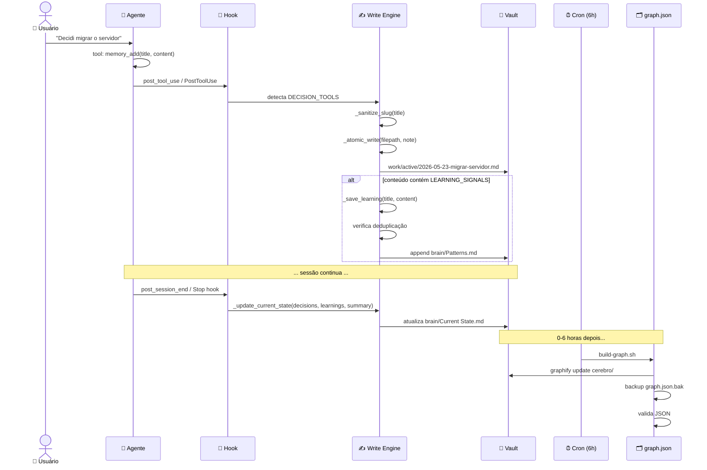
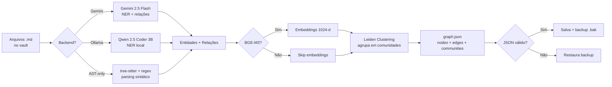
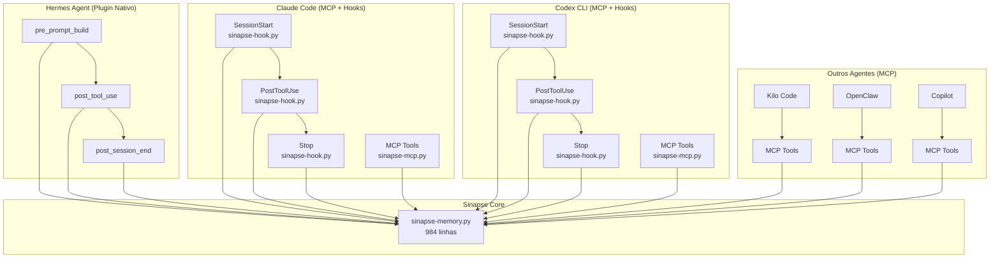
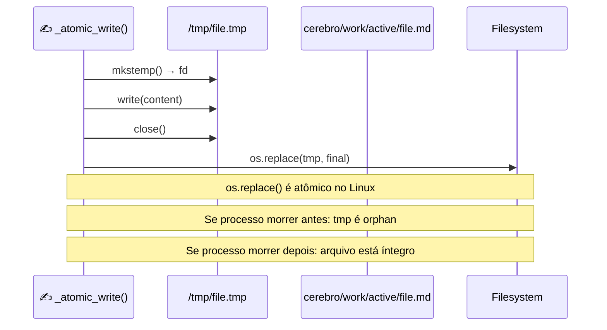
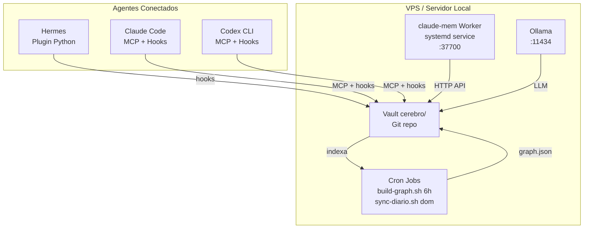

# 05 — Blueprints e Fluxogramas

> **Sinapse Agent v1.1.0** — Diagramas Mermaid da arquitetura e fluxos de dados.
> Renderize em: https://mermaid.live ou GitHub (nativo).

---

## 1. Arquitetura de 4 Camadas



---

## 2. Fluxo de Leitura (Read Path)



---

## 3. Fluxo de Escrita (Write Path)



---

## 4. Circuit Breaker + Fallback Chain

```mermaid
graph TD
    Q[Query: "projeto thoth"] --> B0{NeuralMemory<br/>disponível?}
    
    B0 -->|✅ Sim| NM[nmem recall]
    B0 -->|❌ 3+ falhas| B1{claude-mem<br/>disponível?}
    NM -->|Resultado| FIM[✅ Retorna contexto]
    NM -->|Falha| B1
    
    B1 -->|✅ Sim| CM[HTTP /api/context/semantic]
    B1 -->|❌ 3+ falhas| B2{Graphify<br/>disponível?}
    CM -->|Resultado| FIM
    CM -->|Falha| B1F{FTS5 fallback}
    B1F -->|Resultado| FIM
    B1F -->|Falha| B2
    
    B2 -->|✅ Sim| GF[graph.json textual search]
    B2 -->|❌ 3+ falhas| NULL[❌ None]
    GF -->|Resultado| FIM
    GF -->|Falha| NULL
```

---

## 5. Pipeline de Indexação (Graphify)



---

## 6. Integração Multi-Agente



---

## 7. Atomic Write Guarantee



---

## 8. Deploy Architecture


