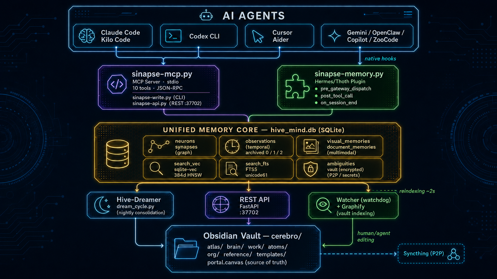
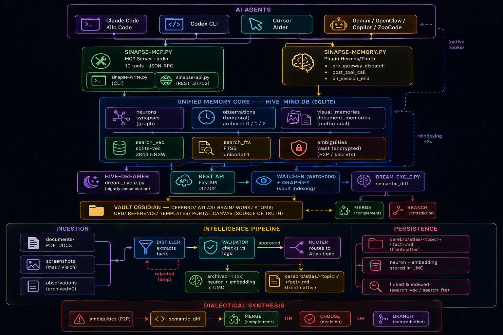
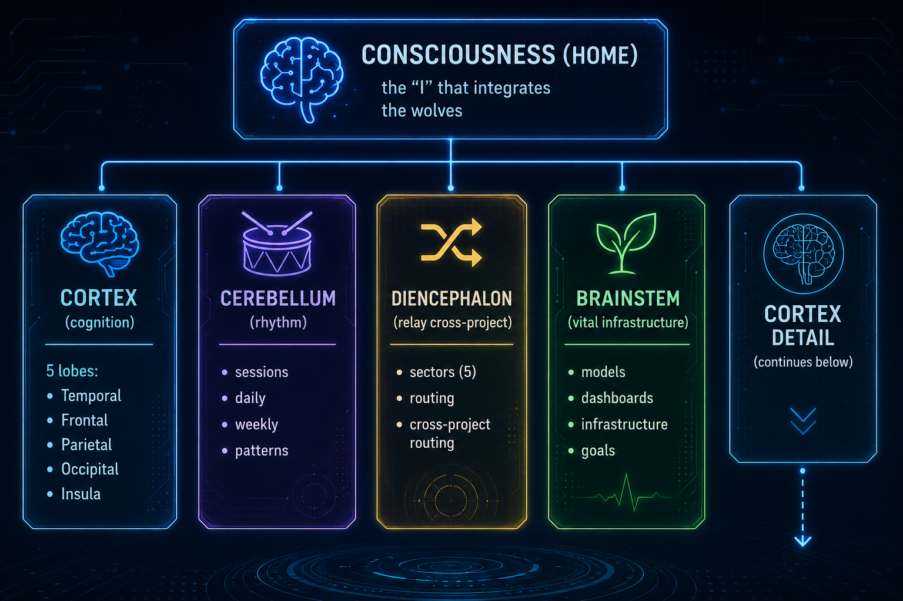

# Architecture — Hive-Mind

> Brain anatomy, Unified Memory Core (UMC), canonical paths, external
> tools as organs, layers and responsibilities, boundaries and controls.
>
> **Reflected version:** v3.10.1 · **Normative reference:** [`architecture.md`](architecture.md)
> (canonical) · **One-page design:** [`blueprint.md`](blueprint.md) ·
> **Flowcharts:** [`blueprint.md`](blueprint.md)

---

## 1. Macro view

```
  ┌──────────────────────────────────────────────────────────────────────┐
  │                          AI AGENTS                                   │
  │                                                                      │
  │  ┌────────────┐ ┌──────────┐ ┌────────┐ ┌────────┐ ┌─────────────┐  │
  │  │Claude Code │ │Codex CLI │ │Cursor  │ │Gemini  │ │Hermes/Thoth │  │
  │  │Kilo Code   │ │          │ │Aider   │ │CLI     │ │(native plugin│  │
  │  └──────┬─────┘ └─────┬────┘ └───┬────┘ └───┬────┘ └──────┬──────┘  │
  └─────────┼─────────────┼──────────┼───────────┼─────────────┼─────────┘
            │             │          │           │             │
            └──────────┬──┴──────────┘           │       (native hooks)
                       │                         │             │
                       ▼                         │             ▼
  ┌────────────────────────────────┐             │  ┌──────────────────────┐
  │  sinapse-mcp.py (MCP Server)  │             │  │ sinapse-memory.py    │
  │  16 tools · stdio JSON-RPC    │             │  │ Hermes plugin         │
  │                               │             │  │ pre_gateway_dispatch │
  │  sinapse-write.py (CLI)       │             │  │ post_tool_call       │
  │  sinapse-api.py (REST :37702) │             │  │ on_session_end       │
  └──────────────────┬────────────┘             │  └──────────┬───────────┘
                     └─────────────────────────┬┘             │
                                                │              │
                                                ▼              ▼
  ┌────────────────────────────────────────────────────────────────────┐
  │                 UNIFIED MEMORY CORE — hive_mind.db               │
  │                                                                    │
  │  ┌──────────────┐  ┌────────────────┐  ┌───────────────────────┐  │
  │  │  neurons     │  │  observations  │  │  visual_memories      │  │
  │  │  synapses    │  │  archived: 0   │  │  document_memories    │  │
  │  │  (graph)     │  │  1=ok 2=quarant│  │  (multimodal)         │  │
  │  └──────┬───────┘  └───────┬────────┘  └───────────────────────┘  │
  │         │                  │                                        │
  │  ┌──────▼───────┐  ┌───────▼───────┐  ┌───────────────────────┐  │
  │  │  search_vec  │  │  search_fts   │  │  ambiguities          │  │
  │  │  (sqlite-vec │  │  (FTS5        │  │  (P2P conflicts)      │  │
  │  │   1024d HNSW)│  │   unicode61)  │  │  vault (secrets)      │  │
  │  └──────────────┘  └───────────────┘  └───────────────────────┘  │
  └─────────────────────────────┬──────────────────────────────────────┘
                                │                   ▲
               ┌────────────────┼──────────┐        │ reindex ~2s
               │                │          │        │
               ▼                ▼          │  ┌─────┴──────────────────┐
  ┌────────────────┐  ┌──────────────┐    │  │  Watcher (watchdog)    │
  │  Hive-Dreamer  │  │  REST API    │    │  │  + Graphify            │
  │  dream_cycle.py│  │  FastAPI     │    │  │  vault → neurons +     │
  │  (a cada 4h)   │  │  :37702      │    │  │  embeddings + FTS      │
  └───────┬────────┘  └──────────────┘    │  └────────────────────────┘
          │                               │              ▲
          ▼                               │              │ edits
  ┌───────────────────────────────────┐   │              │
  │  Obsidian Vault — cerebro/        │───┘──────────────┘
  │  cortex/  cerebelo/               │
  │  diencefalo/  tronco/             │ ◄─── Syncthing P2P (optional)
  │  portal.canvas  (source of truth) │
  └───────────────────────────────────┘
```

> **Reference images:**
> 
> 

---

## 2. Brain anatomy

Hive-Mind is organized **like a brain**. The `cerebro/` vault mirrors the anatomy — **four sibling
lobes under Consciousness**, and the Cortex has **five sub-lobes of its own**.

```
                          ┌─────────────────────────────────────┐
                          │   🧠 Consciousness (Home)           │
                          │   "self" integrating the lobes      │
                          └──────────────┬──────────────────────┘
                                         │
        ┌──────────────────┬─────────────┼─────────────┬──────────────────┐
        │                  │             │             │                  │
   ┌────▼─────────┐  ┌──────▼─────┐  ┌────▼─────┐  ┌────▼────────┐  ┌────▼────────┐
   │ 🧠 CORTEX    │  │ 🥁 CEREBELLUM│ │ 🔀 DIENCEPHALON│ │ 🌿 STEM  │  │  (cortex    │
   │ (cognition) │  │ (rhythm)   │  │ (cross-   │  │ (vital     │  │   detail)  │
   │             │  │            │  │  project  │  │  infra)    │  │            │
   │ 5 sublobes: │  │ • sessoes/ │  │  relay)   │  │ • modelos/ │  │ (continues │
   │ • Temporal  │  │ • diario/  │  │            │  │ • paineis/ │  │   below)   │
   │ • Frontal   │  │ • semanal/ │  │ • setores/ │  │ • infra/   │  │            │
   │ • Parietal  │  │ • padroes/ │  │   (5)      │  │ • meta/    │  │            │
   │ • Occipital │  │            │  │ • roteamento/  │         │  │            │
   │ • Insula    │  │            │  │            │  │            │  │            │
   └─────────────┘  └────────────┘  └────────────┘  └────────────┘  └────────────┘
```

**The four lobes under Consciousness are pairs** (Cortex, Cerebellum, Diencephalon, Brainstem) — there is no
hierarchy among them. The Brainstem **is not a descendant** of any other lobe; it is a sibling.

> **Reference image:** 

### 2.1 Cortex — higher cognition (5 sub-lobes)

```
   🧠 CORTEX
   ├── ⏱ TEMPORAL     — memória de longo prazo, eixo primário por projeto
   │       └── <projeto>/<topico>/neuronio-<hash>.md
   ├── 🎯 FRONTAL     — decisões, planejamento, trabalho ativo
   │       └── decisoes/  trabalho/{active,ativo,arquivo}/
   │           projetos/  brain/  org/{people,teams}/
   ├── 📥 PARIETAL    — sensorial (inbox, referências)
   │       └── inbox/{visual,documents}/  referencias/  analises/
   ├── 👁 OCCIPITAL   — visão (capturas + grafo de conhecimento)
   │       └── capturas-visuais/  grafo/graph.json
   └── 💓 INSULA      — interocepção, autoconsciência
           └── saude/  conflitos/
```

#### 2.1.1 Temporal Lobe — detail (primary axis of the brain)

The temporal lobe holds the **long-term memory organized by project**. It is the **primary axis** of the
brain. Generic structure (projects and topics are fictional — `projeto-A`, `topico-1`, etc.):

```
cortex/temporal/
├── projeto-A/                     # project-neuron (exemplo)
│   ├── topico-1/                  # topic-neuron (1 neurônio = 1 fato atômico)
│   ├── topico-2/
│   └── topico-3/
├── projeto-B/                     # project-neuron (exemplo)
│   ├── topico-1/
│   ├── topico-2/
│   ├── topico-3/
│   ├── topico-4/
│   ├── topico-5/
│   └── topico-6/
├── projeto-C/                     # project-neuron (exemplo)
├── projeto-D/                     # project-neuron (exemplo)
├── projeto-E/                     # project-neuron (exemplo)
├── projeto-F/                     # project-neuron (exemplo)
├── projeto-G/                     # project-neuron (exemplo)
├── projeto-H/                     # project-neuron (exemplo)
├── projeto-I/                     # project-neuron (exemplo)
│
├── _global/                        # conhecimento sem projeto (preferências globais)
├── hipocampo/                      # consolidação: staging + quarentena do Dream Cycle
└── arquivo/                        # memória fria (>90d, substância profunda)
```

Each `neuronio-<hash>.md` has frontmatter with `integrity_hash` (SHA-256 of the content) and is unique by hash —
**neurons never duplicate**. The SQLite index (UMC `hive_mind.db`) accelerates queries over these neurons;
the `vault` remains the single source of truth.

### 2.2 Cerebellum — rhythm and coordination

```
   🥁 CEREBELO
   ├── sessoes/   → logs de sessão de trabalho (YYYY/MM/YYYY-MM-DD-HHMM-{slug}.md)
   ├── diario/    → reflexões diárias (YYYY/MM/YYYY-MM-DD.md)
   ├── semanal/   → sínteses semanais (YYYY-Wxx.md)
   ├── mensal/    → sínteses mensais (YYYY-MM.md) — modelo forte
   ├── anual/     → sínteses anuais (YYYY.md) — modelo forte/batch
   └── padroes/   → padrões aprendidos (memória procedural)
       └── cerebro/cerebelo/padroes/Patterns.md  (referência canônica humana,
            mas NÃO o único neurônio de aprendizado — cada aprendizado vira um
            átomo em cortex/temporal/)
```

The hierarchical cadence (session → daily → weekly → monthly → yearly) is the brain's temporal axis
(see [`architecture.md` §29](architecture.md)). Each layer has its own
purpose, model, and promotion rule.

### 2.3 Diencephalon — cross-project relay

```
   🔀 DIENCEFALO
   ├── setores/     → conhecimento que cruza vários projetos
   │   ├── setor-1.md      ← neurônios usados por vários projetos
   │   ├── setor-2.md
   │   ├── setor-3.md
   │   ├── setor-4.md
   │   └── setor-5.md
   └── roteamento/  → regras de roteamento de conhecimento entre projetos
```

### 2.4 Brainstem — vital infrastructure (sibling of the other 3, not a descendant)

```
   🌿 TRONCO
   ├── modelos/   → templates Obsidian tipados (Atom, Work, Decision, Thinking, Cold Analysis)
   ├── paineis/   → bases Obsidian (.base) — Work Dashboard, Incidents, People, Review Evidence
   ├── infra/     → configuração de infraestrutura do vault
   └── meta/      → meta-informação do vault, sub-vaults, links entre vaults
```

### 2.5 Lobe → function → technical component mapping

| Lobe | Function | Where it lives in code/vault |
|---|---|---|
| **Frontal cortex** | Decision, planning, work | `core/`, `scripts/dream/dream_cycle.py` (dialectic synthesis), `cerebro/cortex/frontal/{decisoes,trabalho,brain,projetos,org}`, `core/knowledge/decision_promoter.py`, `core/knowledge/work_tracker.py`, MCP `save_decision`/`plan_goal` |
| **Parietal cortex** | Sensory — inbox, references, documents | `scripts/capture/`, `core/knowledge/document_ingest.py` (→ `DocumentPipeline`), `cerebro/cortex/parietal/{inbox,referencias}`, `cerebro/cortex/parietal/inbox/documents/` |
| **Occipital cortex** | Vision — captures + **graph** | `scripts/capture/visual_capture.py`, MCP `sinapse_capture_screen` (→ `visual_memories`, `capturas-visuais/`), `integrations/graphify/` (→ `cerebro/cortex/occipital/grafo/graph.json`), visual stage in the Dream Cycle |
| **Temporal cortex** | Long-term memory by project | `cerebro/cortex/temporal/<projeto>/<topico>/neuronio-*.md` + UMC `hive_mind.db` (indexer); `core/knowledge/claude_mem_bridge.py` (→ Dream Cycle), `core/knowledge/drift_detector.py`, `core/knowledge/topic_consolidator.py`, `core/knowledge/alias_miner.py` |
| **Insular cortex** | Health, self-awareness, ambiguities | `scripts/health/{health_dashboard,alert_dispatcher}.py`, `scripts/knowledge/{review_writer,conflict_detector}.py`, `cerebro/cortex/insula/{saude,conflitos}`, `core/knowledge/ambiguities.py` (dialectic synthesis) |
| **Cerebellum** | Rhythm — session, daily, weekly, monthly, yearly, patterns | `scripts/dream/{session_consolidator,daily_writer,weekly_synthesizer,monthly_synthesizer,yearly_synthesizer,pattern_distiller}.py`, `cerebro/cerebelo/{sessoes,diario,semanal,mensal,anual,padroes}/` + `cerebro/cerebelo/padroes/Patterns.md` |
| **Diencephalon** | Cross-project relay | `core/knowledge/sector_classifier.py`, `core/knowledge/generate_mocs.py`, `cerebro/diencefalo/{setores,roteamento}` |
| **Brainstem** | Vital infrastructure | `cerebro/tronco/{modelos,paineis,infra,meta}/` — templates, bases, config, sub-vaults; more static than promoted |

---

## 3. Unified Memory Core (UMC)

A single SQLite database (`hive_mind.db`) with `sqlite-vec` loaded at runtime. Schema in
[`core/umc_schema.sql`](../core/umc_schema.sql).

### Entity diagram

```
  neurons (UUID v4)              observations (UUID v4)
  ─────────────────              ──────────────────────
  id          PK                 id            PK
  label                          session_id
  type                           project
  source_file  (vault-relative)  type          decision|learning|event
  content                        title
  hash         SHA-256           content
  metadata     JSON              archived      0=pending 1=ok 2=quarantine
  community    Leiden cluster    neuron_id     FK→neurons (optional)
  visibility   private|shared|   goal_id       FK→goals (HM-11)
               public (HM-12)    why           TEXT (HM-11)
  indexed_at   TIMESTAMP (HM-11)
  created_at
  updated_at                     ambiguities (UUID v4)
       │                         ────────────────────
       │ triggers FTS sync       id            PK
       ▼                         neuron_id     FK→neurons
  search_fts (FTS5)              source_a_hash SHA-256
  ─────────────────              source_b_hash SHA-256
  neuron_id   UNINDEXED          content_a
  label                          content_b
  content                        status   pending|synthesized|branched
  tokenize=unicode61
                                 causal_edges (HM-11)
  search_vec (vec0)              ────────────────────
  ──────────────────             id             PK
  neuron_id   PK                 cause_neuron_id FK→neurons
  embedding   FLOAT[1024]        effect_neuron_id FK→neurons
                                 label, confidence, source
                                 (indexes on cause and effect)

  goals (HM-11)                  visual_memories / document_memories
  ─────────────                  ──────────────────────────────────
  id          PK                 id, path, description/summary
  description                    topics, hash (dedup), neuron_id FK
  steps_json  TEXT (JSON)
  status      active|…           vault (encrypted secrets)
  created_at                     ───────────────────────
                                 id             PK
  synapses (UUID v4)             encrypted_secret  BLOB (Fernet)
  ─────────────────              metadata          JSON
  id          PK
  source_id   FK→neurons
  target_id   FK→neurons
  relation    TEXT
  weight      FLOAT
```

### Technical guarantees

| Guarantee | Implementation |
|---|---|
| Automatic FTS sync | `AFTER INSERT/UPDATE/DELETE` triggers on `neurons` |
| Impossible P2P collision | UUID v4 in all PKs |
| Divergence detection | SHA-256 of content in `neurons.hash` |
| Auditable queue | `observations.archived` indexed (`idx_observations_archived`) — never `LIKE` in JSON |
| Performance | `journal_mode=WAL`, `synchronous=NORMAL`, `busy_timeout=5000` |

---

## 4. Canonical paths (`core/paths.py`)

The anatomy is encoded in `core/paths.py`. Exposed constants:

```python
CORTEX     = VAULT_ROOT / "cortex"      # Cortex (5 sub-lobes)
TEMPORAL   = CORTEX / "temporal"        # Temporal lobe (memory)
FRONTAL    = CORTEX / "frontal"         # Frontal lobe (decision)
PARIETAL   = CORTEX / "parietal"        # Parietal lobe (sensory)
OCCIPITAL  = CORTEX / "occipital"       # Occipital lobe (vision/graph)
INSULA     = CORTEX / "insula"          # Insula lobe (self-awareness)
DIENCEFALO = VAULT_ROOT / "diencefalo"  # Diencephalon (relay)
SECTORS_ROOT = DIENCEFALO / "setores"
CEREBELO   = VAULT_ROOT / "cerebelo"    # Cerebellum (rhythm)
DAILY_ROOT, SESSIONS_ROOT, WEEKLY_ROOT, PADROES_ROOT = cerebelo/...
TRONCO     = VAULT_ROOT / "tronco"      # Brainstem (infra)
META_ROOT, MODELOS_ROOT, PAINEIS_ROOT = tronco/...
```

**Rule:** any new code that creates/modifies a file in the vault **must use these constants**,
not hardcoded paths. Per-lobe detail in `cerebro/cortex/cortex.md`, `cerebro/cerebelo/cerebelo.md`,
`cerebro/diencefalo/diencefalo.md`, `cerebro/tronco/tronco.md`, and `cerebro/cortex/{frontal,parietal,occipital,temporal,insula}/*.md`.

---

## 5. External tools as organs of the brain

The tools that feed the brain **are not parallel databases**. They are **organs of the same brain**,
contributing to a single perception (the response of `sinapse_query` and the `RetrievalRouter`). Since
K0–K2, the canonical list includes RAGFlow, Milvus, and LlamaIndex as **first-class in adapters/contracts**,
without turning them into parallel sources of truth.

| Tool | Brain organ | Function | Integration form |
|---|---|---|---|
| **UMC** (`hive_mind.db`) | Cortex (central) | Graph + vectors + FTS5 + logs in a single SQLite | **Wrapper** (directory in the repo) |
| **NeuralMemory** | Cortex (association) | Spreading activation, associative memory | **Clone** in `integrations/neural-memory/` (via `components.lock.json`) |
| **sqlite-vec** | Cortex (local vector) | Native HNSW indexing in SQLite — local-first, offline, operational cache | Mandatory (runtime extension loaded) |
| **claude-mem** | Temporal cortex (hippocampus) | `user_prompts`, `observations`, `discoveries`, `session_summaries` — source of temporal evidence | **Wrapper** (HTTP worker `:37700`) |
| **Graphify** | Occipital cortex (structural graph) | Indexes `cerebro/` into `graph.json` with Leiden clustering | **Clone** in `integrations/graphify/` |
| **Graphiti** | Temporal lobe (causality) | Edges with temporal validity (`valid_at`/`invalid_at`) | **Wrapper** (`integrations/graphiti/` + `docker-compose.yml` with digest-pinned image) |
| **LightRAG/GraphRAG** | Diencephalon (multi-hop) | Multi-hop relations and global questions | Wrapper or pip, extensible |
| **RAGFlow** | Parietal cortex (document ingestion) | Adapter for layout-aware parsing, structural chunking, citations | Headless **wrapper** (`integrations/ragflow/` + `ragflow-sdk`); **never** a source of truth — output flows to `document_vectors` + UMC |
| **Milvus** | Cortex (production vector) | Production vector backend for large collections (multi-collection, partition by `workspace_id`) | **Wrapper** (`integrations/milvus/` + `pymilvus`); official production backend of `VectorBackend` |
| **LlamaIndex** | Cortex (composite retrieval) | Adapter for rerank and retrieval workflows | **Pip** (`llama-index` in `pyproject.toml`); **does not** decide routes nor become a source of truth |
| **Filesystem scan** | Parietal cortex (immediate sense) | Reads the vault directly, without waiting for reindexing | Internal |
| **RTK** | Shell optimization | Per-agent/CLI hooks/plugins/instructions for command rewriting | **Clone** in `integrations/rtk/` — **not** a read backend of `sinapse_query` |

### The 7 read backends (fused by `sinapse_query`)

`sinapse_query` fires the **7 read organs** in parallel (circuit breaker + 8s timeout per
backend), fuses via Context Fusion, and returns **a single context package**:

| # | Backend | Role in fusion |
|---|---|---|
| 1 | **UMC** (`hive_mind.db`) | FTS5 + KNN vector + graph + logs |
| 2 | **NeuralMemory** | Spreading activation (association) |
| 3 | **sqlite-vec** | Local semantic (HNSW) |
| 4 | **claude-mem** | Temporal events (hippocampus) |
| 5 | **Graphify** | Structural (Leiden) |
| 6 | **Graphiti** | Temporal causality (`valid_at`/`invalid_at`) |
| 7 | **Filesystem scan** | Direct vault read (TTL 30s, zero gap) |

> **Vendoring rule (negative contract):** `components.lock.json` tracks only **source clones**
> with a pinned commit — currently `graphify`, `neural-memory`, `rtk`. `crsqlite` is vendored as a **downloaded
> platform binary** (version string, not commit) and stays **outside** the lock. `omniparser` is planned,
> not yet implemented. Wrappers (Milvus, RAGFlow, Graphiti) enter via container/SDK; pip covers only
> LlamaIndex and utilities. If Milvus, RAGFlow, or LlamaIndex appear in `components.lock.json` on this
> front, the implementation is wrong (ADR-018).

---

## 6. Layers and responsibilities

### 4-layer architecture

```
  ┌───────────────────────────────────────────────────────────────────┐
  │                            AI AGENTS                              │
  │   Hermes (plugin) · Claude Code · Codex CLI · Cursor · OpenClaw   │
  └──────────────────────────────┬────────────────────────────────────┘
                                 │
  ┌──────────────────────────────▼────────────────────────────────────┐
  │                     INTEGRATION LAYER                             │
  │  sinapse-memory.py (plugin) · sinapse-mcp.py (MCP stdio)          │
  │  sinapse-hook.py (hook universal) · sinapse-api.py (REST :37702)  │
  │  sinapse-write.py (CLI standalone)                                │
  └──────────────────────────────┬────────────────────────────────────┘
                                 │
  ┌──────────────────────────────▼────────────────────────────────────┐
  │                       MEMORY BACKENDS                             │
  │  UMC (SQLite) · claude-mem :37700 · NeuralMemory · RTK (Rust)     │
  └──────────────────────────────┬────────────────────────────────────┘
                                 │
  ┌──────────────────────────────▼────────────────────────────────────┐
  │                           STORAGE                                 │
  │  hive_mind.db · cerebro/ (Obsidian Vault) · backups/              │
  └───────────────────────────────────────────────────────────────────┘
```

### Responsibility matrix

| Component | Responsible for | Independent of |
|---|---|---|
| `cerebro/` | Canonical content | Everything (a pure Obsidian vault works without the system) |
| `core/` | UMC schema, connections, auth, Pydantic schemas | Specific agents |
| `graphify/` | Structural indexing → neurons/synapses | claude-mem, RTK |
| `~/.claude-mem` | Global temporal capture of events → observations | Graphify, RTK |
| `integrations/rtk/` | Per-agent/CLI shell command rewriting | Everything (isolated hook) |
| `integrations/neural-memory/` | Associative retrieval (spreading activation) | Other layers |
| `scripts/` | Pipeline, servers, operations | — |
| `plugins/hermes/` | Bidirectional Hermes ↔ UMC ↔ vault bridge | — |
| `sinapse.yaml` | Central config (paths, ports, agents) | — |
| `install.sh` / `install.bat` | Universal installation (12 steps / native Windows) | — |
| `config/runtime.yaml` | Declarative manifest of services/jobs (control plane) | — |

---

## 7. Boundaries and controls

| Boundary/control | How it is enforced | Source |
|---|---|---|
| **Circuit breaker** | backend with 3+ consecutive failures enters 30s cooldown; only exceptions/timeouts count (empty result is not a failure) | §5 |
| **Quarantine** | `archived=2` (structural) vs `archived=0` (transient, retry); nothing is erased by a promotion failure | ADR-016 |
| **Workspace isolation** | `workspace_id` in every critical table; Milvus `partition_key=workspace_id`; leakage between workspaces is a security bug | ADR-015, §30 |
| **Secrets** | regex detection → field-level encryption (`vault` table, Fernet) → `[SECRET:uuid]` placeholder | §6 |
| **PII redaction** | `core/redactor.py` — 8 categories (tokens, email, IPv4/6, absolute paths, SSH/PEM keys, CPF/CNPJ, phone), irreversible, before export | §19 |
| **Signing** | `core/signing.py` — Ed25519, canonical payload excludes volatile fields; verification never raises an exception on invalid signature | §19 |
| **Fail-closed API** | `sinapse-api.py` does not start without `HIVE_MIND_API_KEY`; per-endpoint rate limits | §10 |
| **Fail-closed migrations** | structural migration failure is fail-closed by default; bypass only via `HIVE_ALLOW_DEFERRED_MIGRATIONS=1` | §30.1 |
| **Fail-closed per role** | a role without its own model and without `dreamer` inheritance records an auditable failure and **does not invent** a synthesis | §29.2 |

---

## 8. Further reading (new docs)

| Topic | Document |
|---|---|
| One-page design and ADRs with consequence | [`blueprint.md`](blueprint.md) |
| Capture → Intake → Promotion → Indexing | [`data-pipeline.md`](data-pipeline.md) |
| LLMs, embeddings, roles, fallback | [`ai-models.md`](ai-models.md) |
| Control plane and daemon (`hive-mindd`, `runtime.yaml`) | [`runtime.md`](runtime.md) |
| Command-line interface | [`cli.md`](cli.md) |
| Agent integration (MCP/plugin/hooks) | [`agents.md`](agents.md) |
| Universal provider capture | [`capture.md`](capture.md) |
| Installation (incl. native Windows) | [`installation.md`](installation.md) |
| Operations (cron/jobs/backup) | [`operations.md`](operations.md) |
| Observability and health metrics (K8) | [`observability.md`](observability.md) |
| Incident response and recovery | [`incidents.md`](incidents.md) |
| Security (secrets, redaction, signing) | [`security.md`](security.md) |
| How to develop and extend | [`development.md`](development.md) |
| State handover | [`HANDOVER.md`](HANDOVER.md) |
